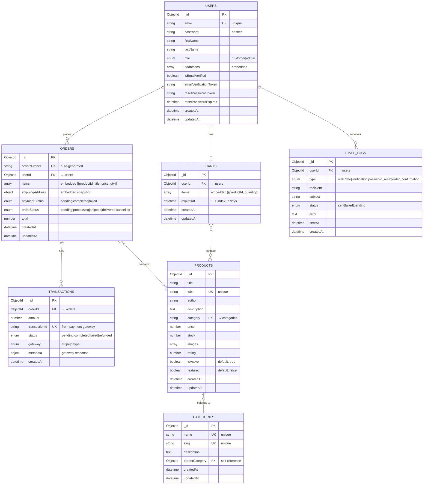

# 📊 MongoDB Bookstore Database Schema

## Mermaid Entity Relationship Diagram



---

## 🔑 Key Relationships

### **Referenced (Normalized)**
- `orders.userId` → `users._id` (One user, many orders)
- `carts.userId` → `users._id` (One user, one cart)
- `transactions.orderId` → `orders._id` (One order, multiple transactions)
- `email_logs.userId` → `users._id` (One user, many emails)
- `products.category` → `categories.name` (Many products, one category)

### **Embedded (Denormalized)**
- `users.addresses[]` - Array of address objects
- `orders.items[]` - Array of order items with product snapshot
- `orders.shippingAddress` - Embedded address snapshot
- `carts.items[]` - Array of cart items

---

## 📝 Field Legend

- **PK** = Primary Key (_id)
- **FK** = Foreign Key (Reference to another collection)
- **UK** = Unique Key
- **→** = References (normalized relationship)
- **embedded** = Nested data (denormalized)
- **enum** = Fixed set of values
- **TTL** = Time To Live index (auto-deletion)

---

## 🎯 Design Decisions

### **Why Normalized (References)?**
✅ `userId` in orders/carts - User data changes frequently
✅ `orderId` in transactions - Order data is independent
✅ `category` in products - Categories are shared

### **Why Denormalized (Embedded)?**
✅ `orders.items[]` - Historical snapshot (preserve price at purchase)
✅ `users.addresses[]` - User owns addresses (small, rarely shared)
✅ `orders.shippingAddress` - Snapshot at time of order

---

## 📊 Collection Statistics (After Seeding)

| Collection | Documents | Purpose |
|------------|-----------|---------|
| users | 1 | Admin user |
| products | 8 | Sample books |
| categories | 4 | Book categories |
| carts | 0 | Empty (created on first add) |
| orders | 0 | Empty (created on checkout) |
| transactions | 0 | Empty (created on payment) |
| email_logs | 0 | Empty (created on email send) |

---

## 🔍 Indexes

### **Automatically Created**
- All `_id` fields (primary key)

### **Manually Created (from seedDatabase.js)**
- `users.email` - Unique index
- `products.isbn` - Unique index
- `products.title` - Text index (search)
- `categories.slug` - Unique index
- `carts.userId` - Regular index
- `carts.expiresAt` - TTL index (7 days)
- `orders.orderNumber` - Unique index
- `orders.userId` - Regular index
- `transactions.transactionId` - Unique index

---

## 🚀 Query Patterns

### **Common Queries**
```javascript
// Get user with orders
db.users.aggregate([
  { $lookup: { from: 'orders', localField: '_id', foreignField: 'userId', as: 'orders' } }
])

// Get order with user and transaction
db.orders.aggregate([
  { $lookup: { from: 'users', localField: 'userId', foreignField: '_id', as: 'user' } },
  { $lookup: { from: 'transactions', localField: '_id', foreignField: 'orderId', as: 'transactions' } }
])

// Search products by text
db.products.find({ $text: { $search: "clean code" } })

// Get active products by category
db.products.find({ category: "Technology", isActive: true })

// Get user's cart
db.carts.findOne({ userId: ObjectId("...") })
```

---

## 📈 Scalability Considerations

### **Current Design (MVP)**
✅ Simple structure for initial launch
✅ Fast reads with embedded data
✅ Flexible schema for iterations

---

## 🎯 View in VS Code

If you're using VS Code:

1. Install **Markdown Preview Mermaid Support** extension
2. Open this file (`DATABASE-SCHEMA-DIAGRAM.md`)
3. Press `Ctrl+Shift+V` to preview
4. The diagram will render automatically!

---