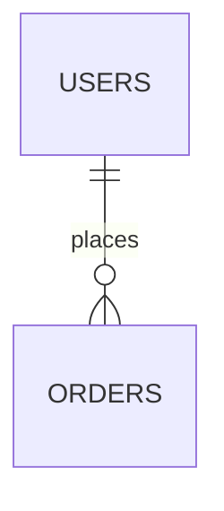
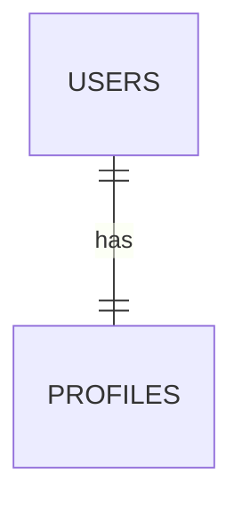
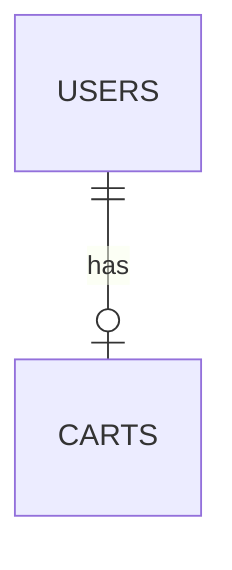
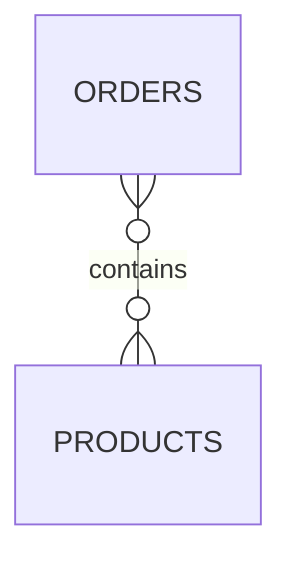
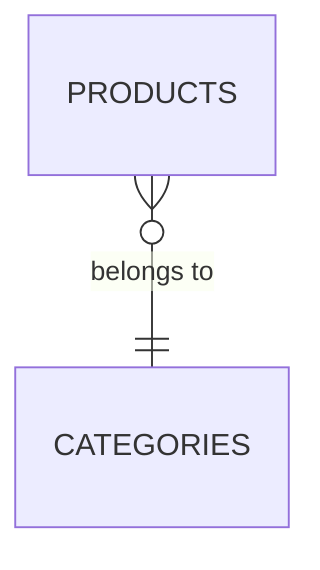
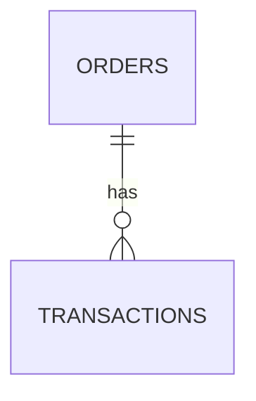
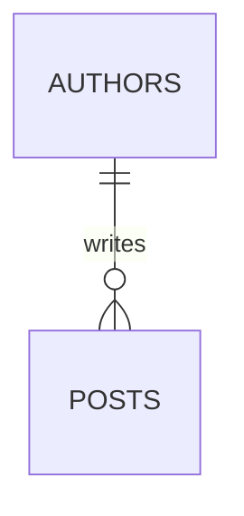
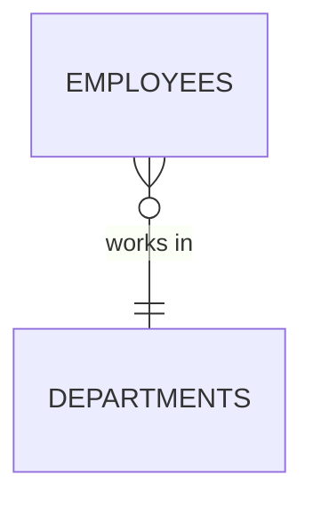

# 🔗 Mermaid ER Diagram Arrow Types Guide

## 📚 Complete Reference for Database Schema Diagrams

---

## 🎯 Basic Syntax

```
ENTITY_A [cardinality][relationship_type] ENTITY_B : "relationship label"
```

**Example:**
`USERS ||--o{ ORDERS : "places"`


---

## 📊 Cardinality Symbols (How Many?)

### **Left Side Symbols (Entity A)**

| Symbol | Meaning | Count | Example |
|--------|---------|-------|---------|
| `\|` | **Exactly one** | 1 | One user |
| `o` | **Zero or one** | 0..1 | Optional relationship |
| `}` | **Zero or more** | 0..N | Many records |

### **Right Side Symbols (Entity B)**

| Symbol | Meaning | Count | Example |
|--------|---------|-------|---------|
| `\|` | **Exactly one** | 1 | One category |
| `o` | **Zero or one** | 0..1 | Optional cart |
| `{` | **Zero or more** | 0..N | Many orders |

---

## 🎨 Relationship Types (Line Style)

| Symbol | Meaning | Visual | Use Case |
|--------|---------|--------|----------|
| `--` | **Identifying** | Solid line | Strong/required relationship |
| `..` | **Non-identifying** | Dashed line | Weak/optional relationship |

---

## 📖 Common Relationship Patterns

### **1. One-to-Many (1:N): `USERS ||--o{ ORDERS : "places"`** ⭐ Most Common


**Breakdown:**
- `||` (left) = Exactly **one** user
- `--` = Solid line (identifying)
- `o{` (right) = **Zero or many** orders

**Reads as:** "One user places zero or many orders"

**MongoDB Implementation:**
```javascript
// orders collection
{
  userId: ObjectId("user123"),  // Reference to users
  orderNumber: "ORD-123",
  total: 99.99
}
```

---

### **2. One-to-One (1:1): `USERS ||--|| PROFILES : "has"`**



**Breakdown:**
- `||` (left) = Exactly **one** user
- `--` = Solid line
- `||` (right) = Exactly **one** profile

**Reads as:** "One user has exactly one profile"

---

### **3. One-to-Zero-or-One (1:0..1): `USERS ||--o| CARTS : "has"`**



**Breakdown:**
- `||` (left) = Exactly **one** user
- `--` = Solid line
- `o|` (right) = **Zero or one** cart

**Reads as:** "One user has zero or one cart"

**MongoDB Implementation:**
```javascript
// carts collection
{
  userId: ObjectId("user123"),  // Unique index ensures 1:1
  items: [ /* cart items */ ]
}
```

---

### **4. Many-to-Many (M:N): `ORDERS }o--o{ PRODUCTS : "contains"`**



**Breakdown:**
- `}o` (left) = **Zero or many** orders
- `--` = Solid line
- `o{` (right) = **Zero or many** products

**Reads as:** "Many orders contain many products"

**MongoDB Implementation (Embedded):**
```javascript
// orders collection
{
  orderId: ObjectId("order123"),
  items: [                        // Embedded many-to-many
    {
      productId: ObjectId("prod1"),
      quantity: 2,
      price: 19.99
    }
  ]
}
```

---

### **5. Many-to-One (N:1): `PRODUCTS }o--|| CATEGORIES : "belongs to"`**



**Breakdown:**
- `}o` (left) = **Zero or many** products
- `--` = Solid line
- `||` (right) = Exactly **one** category

**Reads as:** "Many products belong to one category"

**MongoDB Implementation:**
```javascript
// products collection
{
  title: "Clean Code",
  category: "Technology",  // String reference to category
  price: 39.99
}
```

---

## 🎓 Complete Cardinality Table

| Code | Visual Representation | Meaning | Example Use Case |
|------|----------------------|---------|------------------|
| `\|\|--\|\|` | One-to-One | Exactly 1:1 | User ↔ Profile |
| `\|\|--o\|` | One-to-Optional | 1 to 0..1 | User → Cart |
| `\|\|--o{` | One-to-Many | 1 to 0..N | User → Orders ⭐ |
| `}o--o{` | Many-to-Many | 0..N to 0..N | Orders ↔ Products |
| `}o--\|\|` | Many-to-One | 0..N to 1 | Products → Category ⭐ |
| `}\|--\|{` | At-least-one to Many | 1..N to 1..N | Invoice ↔ Items |

---

## 📋 Your Bookstore Database Examples

### **Example 1: Users and Orders**


**Translation:**
- One `USERS` record
- Has **zero or many** `ORDERS` records
- Strong relationship (identifying)

**Code:**
```javascript
// users collection
{ _id: ObjectId("user123"), email: "john@test.com" }

// orders collection (multiple documents reference same user)
{ _id: ObjectId("ord1"), userId: ObjectId("user123"), total: 25.99 }
{ _id: ObjectId("ord2"), userId: ObjectId("user123"), total: 42.50 }
{ _id: ObjectId("ord3"), userId: ObjectId("user123"), total: 18.00 }
```

---

### **Example 2: Users and Carts**


**Translation:**
- One `USERS` record
- Has **zero or one** `CARTS` record
- Strong relationship

**Code:**
```javascript
// users collection
{ _id: ObjectId("user123"), email: "john@test.com" }

// carts collection (max one cart per user)
{ _id: ObjectId("cart1"), userId: ObjectId("user123"), items: [...] }
// Unique index on userId ensures 1:0..1 relationship
```

---

### **Example 3: Orders and Transactions**



**Translation:**
- One `ORDERS` record
- Has **zero or many** `TRANSACTIONS` records
- One order can have multiple payment attempts

**Code:**
```javascript
// orders collection
{ _id: ObjectId("ord1"), orderNumber: "ORD-123", total: 99.99 }

// transactions collection (multiple payments for same order)
{ _id: ObjectId("tx1"), orderId: ObjectId("ord1"), status: "failed" }
{ _id: ObjectId("tx2"), orderId: ObjectId("ord1"), status: "completed" }
```

---

### **Example 4: Orders and Products (Many-to-Many)**


**Translation:**
- One order can contain **many products**
- One product can be in **many orders**
- Embedded implementation (denormalized)

**Code:**
```javascript
// orders collection (embeds product data)
{
  _id: ObjectId("ord1"),
  items: [
    { productId: ObjectId("prod1"), title: "Book A", price: 19.99, qty: 2 },
    { productId: ObjectId("prod2"), title: "Book B", price: 29.99, qty: 1 }
  ]
}

// products collection (referenced by multiple orders)
{ _id: ObjectId("prod1"), title: "Book A", price: 19.99, stock: 50 }
{ _id: ObjectId("prod2"), title: "Book B", price: 29.99, stock: 30 }
```

---

### **Example 5: Products and Categories (Many-to-One)**


**Translation:**
- Many `PRODUCTS` records
- Each belongs to exactly **one** `CATEGORIES` record

**Code:**
```javascript
// categories collection
{ _id: ObjectId("cat1"), name: "Technology", slug: "technology" }

// products collection (multiple products in same category)
{ _id: ObjectId("p1"), title: "Clean Code", category: "Technology" }
{ _id: ObjectId("p2"), title: "Design Patterns", category: "Technology" }
{ _id: ObjectId("p3"), title: "Refactoring", category: "Technology" }
```

---

## 🔍 Reading Direction

**Always read LEFT to RIGHT:**

```
ENTITY_A [cardinality_A] [line] [cardinality_B] ENTITY_B : "description"
```

**Steps to Read:**
1. Start with Entity A (left)
2. Look at left cardinality (how many A?)
3. Look at right cardinality (how many B?)
4. Read the relationship label

**Example:**
```
USERS ||--o{ ORDERS : "places"
  ↑    ↑  ↑ ↑   ↑         ↑
  │    │  │ │   │         └─ Label: what A does to B
  │    │  │ │   └─────────── Entity B
  │    │  │ └─────────────── Many B (0 or more)
  │    │  └───────────────── Solid line (identifying)
  │    └──────────────────── One A (exactly 1)
  └───────────────────────── Entity A
```

---

## 💡 Quick Reference Cheat Sheet

### **Symbols at a Glance**

```
|  = Exactly one (1)
o  = Zero or one (0..1)
{  = Zero or many (0..N)  [right side]
}  = Zero or many (0..N)  [left side]
-- = Solid line (identifying)
.. = Dashed line (non-identifying)
```

### **Common Patterns**

```
||--o{  = One to many (1:N) ⭐
||--o|  = One to optional (1:0..1)
||--||  = One to one (1:1)
}o--o{  = Many to many (M:N) ⭐
}o--||  = Many to one (N:1) ⭐
```

---

## 🎯 Pro Tips

### **Tip 1: Start with "One" Side**
Always identify which entity has "one" in the relationship first.

```
USERS ||--o{ ORDERS
  ↑           ↑
  One        Many
```

### **Tip 2: Optional vs Required**
- Use `o` for **optional** (may not exist)
- Use `|` for **required** (must exist)

```
USERS ||--o| CARTS    // User may not have a cart yet
USERS ||--|| PROFILE  // User must have a profile
```

### **Tip 3: MongoDB Implementation**
- `||--o{` → Use **foreign key reference** (normalized)
- `}o--o{` → Use **embedded array** or **junction collection**

---

## 🚀 Practice Examples

### **Exercise 1: Students and Courses**

**Answer:** Many students enroll in many courses (M:N)

### **Exercise 2: Blog Posts and Authors**

**Answer:** One author writes many posts (1:N)

### **Exercise 3: Employees and Departments**

**Answer:** Many employees work in one department (N:1)

---

## 📚 Additional Resources

- **Mermaid Official Docs:** https://mermaid.js.org/syntax/entityRelationshipDiagram.html
- **Live Editor:** https://mermaid.live/
- **VS Code Extension:** Markdown Preview Mermaid Support

---

## ✅ Summary

| Symbol | Meaning | When to Use |
|--------|---------|-------------|
| `\|` | Exactly one | Required relationship, must exist |
| `o` | Zero or one | Optional relationship, may or may not exist |
| `{` / `}` | Zero or many | Collection, array, or multiple records |
| `--` | Solid line | Strong/identifying relationship |
| `..` | Dashed line | Weak/non-identifying relationship |

**Most Common in MongoDB:**
- `||--o{` - One-to-many (e.g., User → Orders)
- `}o--||` - Many-to-one (e.g., Products → Category)
- `}o--o{` - Many-to-many (e.g., Orders ↔ Products)

---

**Happy Diagramming! 🎨**
