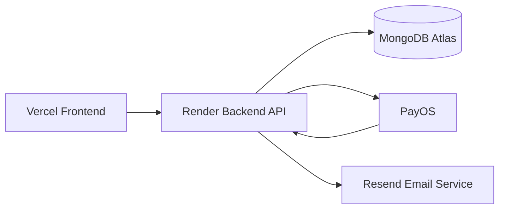
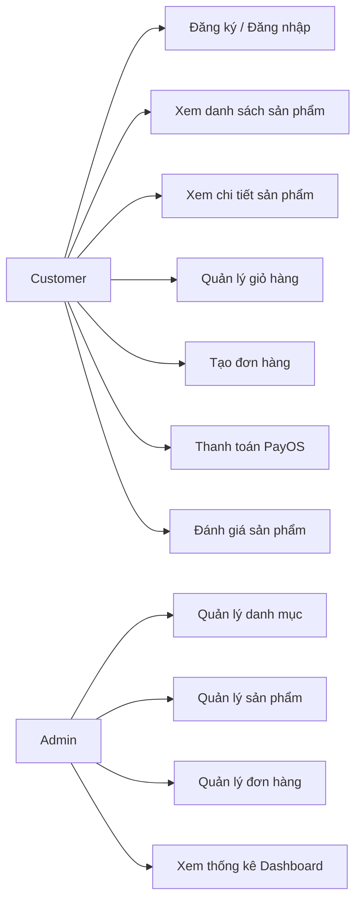
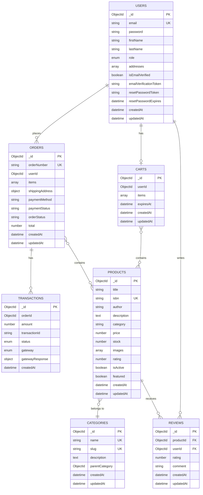
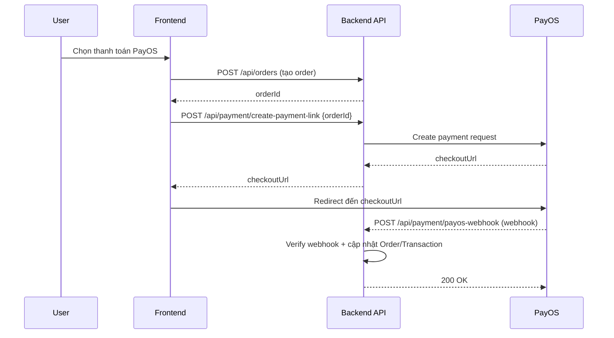

# BÁO CÁO ĐỒ ÁN CHUYÊN ĐỀ BACKEND

**Tên đề tài:** Xây dựng REST API cho hệ thống Bookstore E‑Commerce (Node.js/Express + MongoDB)

**Sinh viên:** [HỌ TÊN SINH VIÊN]

**MSSV:** [MSSV]

**Lớp:** [LỚP]

**Giảng viên hướng dẫn:** [TÊN GIẢNG VIÊN]

**Môn học:** Chuyên đề Backend

**Thời gian thực hiện:** [Từ ngày … đến ngày …]

**Ngày nộp:** 13/01/2026

---

<a id="loi-mo-dau"></a>
## Lời mở đầu

Trong bối cảnh thương mại điện tử phát triển nhanh, nhu cầu xây dựng các hệ thống backend linh hoạt, an toàn và dễ mở rộng ngày càng quan trọng. Đồ án này tập trung triển khai **REST API** cho mô hình **Bookstore E‑Commerce**, nhằm củng cố các kiến thức cốt lõi của môn Chuyên đề Backend như: thiết kế API theo chuẩn REST, xác thực và phân quyền (JWT), thiết kế cơ sở dữ liệu MongoDB, bảo mật cơ bản, tài liệu hoá API bằng Swagger và tích hợp thanh toán.

Báo cáo trình bày mục tiêu, phạm vi, kiến trúc, thiết kế dữ liệu, thiết kế API, kiểm thử và triển khai, đồng thời tổng kết kết quả đạt được và định hướng mở rộng trong tương lai.

<a id="loi-cam-on"></a>
## Lời cảm ơn

Em xin chân thành cảm ơn **Giảng viên hướng dẫn** đã hỗ trợ, góp ý và định hướng trong suốt quá trình thực hiện đồ án. Em cũng cảm ơn các bạn học và những nguồn tài liệu tham khảo đã giúp em hoàn thiện kiến thức và triển khai hệ thống.

Do thời gian và kinh nghiệm còn hạn chế, báo cáo có thể còn thiếu sót; em mong nhận được góp ý để cải thiện hơn.

## Mục lục

- [Lời mở đầu](#loi-mo-dau)
- [Lời cảm ơn](#loi-cam-on)

1. [Giới thiệu](#1-giới-thiệu)
   - [Lý do chọn đề tài](#11-lý-do-chọn-đề-tài)
2. [Mục tiêu và phạm vi](#2-mục-tiêu-và-phạm-vi)
3. [Yêu cầu chức năng & phi chức năng](#3-yêu-cầu-chức-năng--phi-chức-năng)
4. [Công nghệ sử dụng](#4-công-nghệ-sử-dụng)
   - [Ưu nhược điểm công nghệ được sử dụng](#43-ưu-nhược-điểm-công-nghệ-được-sử-dụng)
   - [Môi trường phát triển](#44-môi-trường-phát-triển)
5. [Kiến trúc hệ thống](#5-kiến-trúc-hệ-thống)
6. [Thiết kế cơ sở dữ liệu (MongoDB)](#6-thiết-kế-cơ-sở-dữ-liệu-mongodb)
7. [Thiết kế API (REST) & Swagger](#7-thiết-kế-api-rest--swagger)
8. [Bảo mật và kiểm soát truy cập](#8-bảo-mật-và-kiểm-soát-truy-cập)
9. [Tích hợp thanh toán PayOS](#9-tích-hợp-thanh-toán-payos)
10. [Kiểm thử](#10-kiểm-thử)
11. [Triển khai & vận hành](#11-triển-khai--vận-hành)
12. [Kết quả đạt được](#12-kết-quả-đạt-được)
13. [Hạn chế & hướng phát triển](#13-hạn-chế--hướng-phát-triển)
14. [Tài liệu tham khảo](#14-tài-liệu-tham-khảo)
15. [Phụ lục](#15-phụ-lục)

---

## 1. Giới thiệu

Đồ án xây dựng một **REST API** cho hệ thống **bán sách trực tuyến (Bookstore E‑Commerce)**, tập trung vào các nghiệp vụ backend: xác thực người dùng, quản lý danh mục – sản phẩm, giỏ hàng, đơn hàng, quản trị, thanh toán và tài liệu API.

Repository có 2 phần:
- **Backend:** thư mục `be/` (Node.js + Express + MongoDB/Mongoose)
- **Frontend (demo):** thư mục `fe/` (React + TypeScript + Vite)

Trong phạm vi môn **Chuyên đề Backend**, báo cáo này tập trung mô tả backend và các thành phần liên quan.

### 1.1. Lý do chọn đề tài

- **Tính thực tiễn cao:** mô hình bán hàng trực tuyến là bài toán phổ biến, có đầy đủ nghiệp vụ backend điển hình như xác thực, phân quyền, quản lý dữ liệu, giỏ hàng, đơn hàng, thanh toán.
- **Bao quát kiến thức backend:** đề tài giúp rèn luyện thiết kế REST API, thiết kế CSDL, tối ưu truy vấn, bảo mật (JWT, validation, rate limit) và tài liệu hoá API bằng Swagger.
- **Dễ mở rộng và đánh giá:** hệ thống có thể mở rộng thêm coupon, review/rating, dashboard, analytics; đồng thời dễ đánh giá qua bộ endpoint rõ ràng và dữ liệu seed.
- **Phù hợp công nghệ lựa chọn:** Node.js/Express + MongoDB phù hợp xây dựng MVP nhanh, linh hoạt trong việc thay đổi schema theo tiến độ đồ án.

---

## 2. Mục tiêu và phạm vi

### 2.1. Mục tiêu
- Xây dựng backend theo mô hình RESTful, dễ mở rộng.
- Thiết kế CSDL MongoDB phù hợp nghiệp vụ e-commerce.
- Cung cấp cơ chế **JWT Authentication** và **Role-based Access Control** (admin/customer).
- Tài liệu hoá API bằng **Swagger/OpenAPI**.
- Tích hợp thanh toán **PayOS** ở mức tạo payment link và xử lý webhook.

### 2.2. Phạm vi
- Backend API triển khai đầy đủ các module chính: Auth, Users, Categories, Products, Cart, Orders, Admin, Coupons, Payment.
- Frontend dùng để minh hoạ luồng sử dụng API.

---

## 3. Yêu cầu chức năng & phi chức năng

### 3.1. Yêu cầu chức năng (Functional Requirements)
1. **Xác thực & phân quyền**
   - Đăng ký, đăng nhập, lấy thông tin người dùng hiện tại.
   - Quên mật khẩu và đặt lại mật khẩu qua token.
   - Xác minh email qua token.
   - Phân quyền theo vai trò: `customer`, `admin`.

2. **Quản lý người dùng (User)**
   - Xem/cập nhật hồ sơ.
   - Quản lý danh sách địa chỉ giao hàng (thêm/sửa/xoá).

3. **Danh mục (Category)**
   - CRUD danh mục (admin).
   - Xem danh mục (public).
   - Hỗ trợ phân cấp danh mục (parentCategory).

4. **Sản phẩm (Product)**
   - CRUD sản phẩm (admin).
   - Danh sách sản phẩm có phân trang, lọc, sắp xếp.
   - Tìm kiếm (text search theo title/keyword).

5. **Đánh giá sản phẩm (Review/Rating)**
   - Xem danh sách đánh giá theo sản phẩm (có phân trang).
   - Tạo/Sửa/Xoá đánh giá của bản thân.
   - Chỉ người dùng đã mua và đơn có `paymentStatus=completed` mới được đánh giá.
   - Tự động cập nhật điểm trung bình `rating` và `numReviews` trên sản phẩm.

6. **Giỏ hàng (Cart)**
   - Thêm/sửa/xoá item trong giỏ.
   - Tính tổng tiền, kiểm tra tồn kho.

7. **Đơn hàng (Order)**
   - Tạo đơn hàng từ giỏ.
   - Theo dõi trạng thái đơn.
   - Huỷ đơn và hoàn tồn kho.

8. **Quản trị (Admin)**
   - Quản lý người dùng.
   - Quản lý đơn hàng.
   - Thống kê tổng quan (dashboard).

9. **Mã giảm giá (Coupons)**
   - Validate coupon theo giỏ hàng (preview).
   - Liệt kê coupon phù hợp (phục vụ UI).

10. **Thanh toán (Payment / PayOS)**
   - Tạo payment link theo `orderId`.
   - Nhận webhook PayOS và cập nhật trạng thái thanh toán.

### 3.2. Yêu cầu phi chức năng (Non-functional Requirements)
- **Bảo mật:** Helmet, CORS, JWT, hash password (bcrypt), rate limit.
- **Hiệu năng:** phân trang, index cho các trường tìm kiếm/unique.
- **Khả năng bảo trì:** tách lớp routes/controllers/models/middleware/utils.
- **Tính minh bạch:** có Swagger UI và log request khi dev.

---

## 4. Công nghệ sử dụng

### 4.1. Backend
- **Node.js + Express**: xây dựng REST API.
- **MongoDB + Mongoose**: lưu trữ dữ liệu và ORM/ODM.
- **JWT (jsonwebtoken)**: xác thực.
- **bcrypt**: mã hoá mật khẩu.
- **express-validator**: kiểm tra dữ liệu đầu vào.
- **helmet, cors, express-rate-limit**: bảo mật.
- **morgan**: logging.
- **multer**: upload file (ảnh bìa, v.v.) và serve qua `/uploads`.
- **Swagger (swagger-jsdoc, swagger-ui-express)**: tài liệu API.
- **PayOS (@payos/node)**: tạo link thanh toán và verify webhook.
- **Resend / Nodemailer**: gửi email giao dịch (xác minh email, quên mật khẩu, …).

### 4.2. Frontend (tham khảo)
- React + TypeScript + Vite, Axios.

### 4.3. Ưu nhược điểm công nghệ được sử dụng

| Công nghệ | Ưu điểm | Nhược điểm / Lưu ý |
|---|---|---|
| Node.js | Phù hợp API I/O-bound, hệ sinh thái npm lớn, phát triển nhanh | CPU-bound cần tối ưu/worker; quản lý async cần cẩn thận |
| Express.js | Nhẹ, linh hoạt, dễ tổ chức middleware/routes | Ít “opinionated”, cần tự chuẩn hoá cấu trúc, error handling |
| MongoDB | Schema linh hoạt, truy vấn nhanh với index phù hợp, phù hợp dữ liệu tài liệu | Dễ “lỏng schema” nếu không quản trị; quan hệ phức tạp cần thiết kế embed/reference hợp lý |
| Mongoose | ODM tiện lợi, schema/validation ở tầng ứng dụng, middleware hooks | Có overhead; cần chú ý populate, performance và index |
| JWT (Bearer) | Stateless, dễ scale, dùng cho SPA/mobile | Cần chiến lược revoke/refresh nếu yêu cầu bảo mật cao; bảo vệ secret |
| bcrypt | Hash mật khẩu an toàn, chuẩn thực tế | Tốn CPU hơn; cần chọn cost phù hợp |
| Swagger (OpenAPI) | Tài liệu API tự động, dễ demo/test | Cần duy trì annotation để khớp code |
| PayOS SDK | Tạo payment link nhanh, hỗ trợ webhook | Webhook cần idempotency/chống replay; phụ thuộc bên thứ 3 |
| Resend/Nodemailer | Gửi email giao dịch (verify/forgot password) | Cần cấu hình SPF/DKIM/Domain; xử lý rate limit/queue nếu tải lớn |
| MongoDB Atlas | Managed DB, backup/monitoring, dễ deploy production | Phụ thuộc cloud, cần quản lý IP allowlist/connection string |
| Render (API) | Deploy nhanh, quản lý env vars thuận tiện | Cold start/giới hạn gói; cần cấu hình CORS/domain |
| Vercel (FE) | CI/CD nhanh, tối ưu hosting FE | Cần cấu hình env + domain mapping đúng |

Tóm lại, stack này phù hợp để xây dựng **MVP nhanh**, dễ trình diễn và mở rộng theo yêu cầu môn học.

### 4.4. Môi trường phát triển

- **Hệ điều hành:** Windows (môi trường phát triển).
- **IDE:** Visual Studio Code.
- **Runtime:** Node.js + npm.
- **Database:** MongoDB (local khi phát triển), MongoDB Atlas (production).
- **API testing:** Swagger UI (trong project) và/hoặc Postman/Thunder Client.
- **Version control:** Git.

Ghi chú: phiên bản Node/MongoDB có thể thay đổi theo máy, tuy nhiên project sử dụng các thư viện phổ biến nên tương thích tốt với các phiên bản LTS.

---

## 5. Kiến trúc hệ thống

### 5.1. Tổng quan kiến trúc



### 5.2. Kiến trúc thư mục backend
- `server.js`: khởi tạo Express, middleware, routes, Swagger.
- `routes/`: định nghĩa endpoint và swagger annotations.
- `controllers/`: xử lý nghiệp vụ.
- `models/`: schema Mongoose.
- `middleware/`: middleware xác thực JWT & phân quyền.
- `utils/`: helper (JWT/token/crypto/payOS/currency/coupon pricing...).
- `scripts/`: tạo CSDL & seed dữ liệu.

### 5.4. Cấu trúc project (chi tiết)

#### 5.4.1. Cây thư mục tổng quan

```text
cdbe/
├─ README.md
├─ docs/
│  └─ BAO_CAO_DO_AN_BACKEND.md
├─ be/                      # Backend (Node.js/Express)
│  ├─ server.js
│  ├─ package.json
│  ├─ config/
│  ├─ controllers/
│  ├─ middleware/
│  ├─ models/
│  ├─ routes/
│  ├─ scripts/
│  ├─ utils/
│  └─ uploads/
└─ fe/                      # Frontend demo (React/Vite)
   ├─ package.json
   ├─ vite.config.ts
   └─ src/
      ├─ api/
      ├─ components/
      ├─ context/
      ├─ pages/
      └─ utils/
```

#### 5.4.2. Backend `be/` (mô tả chi tiết)

```text
be/
├─ server.js                # Entry point, middleware, routes, swagger
├─ config/                   # Cấu hình (db/swaggger/upload)
├─ controllers/              # Xử lý nghiệp vụ theo từng module
├─ middleware/               # JWT auth, role authorize
├─ models/                   # Mongoose schema (User/Product/Order/Review/...)
├─ routes/                   # Định nghĩa endpoint + swagger annotation
├─ scripts/                  # Tạo DB, tạo index, seed dữ liệu mẫu
├─ utils/                    # Helper (token/crypto/currency/payos/...)
└─ uploads/                  # File upload tĩnh (serve qua /uploads)
```

Mapping nhanh (backend):
- `routes/*.routes.js` nhận request và gọi `controllers/*`.
- `controllers/*` thao tác dữ liệu qua `models/*`.
- `middleware/auth.middleware.js` bảo vệ route private/admin.
- `config/swagger.js` sinh tài liệu OpenAPI tại `/api-docs`.

#### 5.4.3. Frontend `fe/` (mô tả ngắn)

Frontend được sử dụng để demo luồng người dùng (browse sản phẩm, cart, checkout, payment result) và gọi API qua Axios.

### 5.3. UML/Use Case (tổng quan)




---

## 6. Thiết kế cơ sở dữ liệu (MongoDB)

### 6.1. Mô hình dữ liệu
Hệ thống sử dụng MongoDB theo mô hình kết hợp:
- **Reference (normalize)** cho các quan hệ chính (user–orders, order–transaction).
- **Embedded (denormalize)** cho snapshot ở thời điểm đặt hàng (order items, shippingAddress).

### 6.2. ERD (Mermaid)



Ghi chú: Dự án có thêm các collection/phần mở rộng như Coupon/CouponRedemption tuỳ theo phiên bản code và nhu cầu nghiệp vụ.

### 6.3. Index và tối ưu truy vấn
Một số index quan trọng:
- `users.email` unique.
- `products.isbn` unique.
- `products.title` text index phục vụ search.
- `reviews.productId + reviews.userId` unique (mỗi user chỉ review 1 lần cho mỗi sản phẩm).
- `carts.expiresAt` TTL index để tự xoá giỏ hàng hết hạn.
- `orders.orderNumber` unique.

### 6.4. Từ điển dữ liệu (Data Dictionary)

#### 6.4.1. Collection `users`
| Trường | Kiểu | Ràng buộc | Mô tả |
|---|---|---|---|
| email | string | unique, required | Email đăng nhập |
| password | string | required | Mật khẩu đã hash (bcrypt) |
| firstName, lastName | string | required | Thông tin người dùng |
| role | enum | `customer`/`admin` | Phân quyền |
| addresses | array | optional | Danh sách địa chỉ |
| isEmailVerified | boolean | default false | Trạng thái xác minh email |
| emailVerificationToken | string | optional | Token xác minh (hash) |
| resetPasswordToken | string | optional | Token quên mật khẩu (hash) |
| resetPasswordExpires | datetime | optional | Hạn token quên mật khẩu |

#### 6.4.2. Collection `products`
| Trường | Kiểu | Ràng buộc | Mô tả |
|---|---|---|---|
| title | string | required | Tên sách |
| isbn | string | unique, required | ISBN |
| author | string | required | Tác giả |
| description | string | optional | Mô tả |
| category | string | required | Tên danh mục |
| price | number | required | Giá |
| stock | number | required | Tồn kho |
| images | array | optional | Danh sách URL/đường dẫn ảnh |
| rating | number | default 0 | Điểm trung bình |
| numReviews | number | default 0 | Số lượt đánh giá |
| isActive | boolean | default true | Bật/tắt sản phẩm |
| featured | boolean | default false | Sản phẩm nổi bật |

#### 6.4.3. Collection `orders`
| Trường | Kiểu | Ràng buộc | Mô tả |
|---|---|---|---|
| orderNumber | string | unique | Mã đơn |
| userId | ObjectId | required | Tham chiếu user |
| items | array | required | Snapshot item (tên, giá, qty, productId) |
| shippingAddress | object | required | Snapshot địa chỉ giao |
| paymentMethod | enum | `payos`/`cod` | Phương thức thanh toán |
| paymentStatus | enum | `pending`/`completed`/`failed` | Trạng thái thanh toán |
| orderStatus | enum | `pending`/`processing`/`shipped`/`delivered`/`cancelled` | Trạng thái xử lý |
| total | number | required | Tổng tiền |
| payosOrderCode | number | optional | Mã orderCode dùng cho PayOS |

#### 6.4.4. Collection `reviews`
| Trường | Kiểu | Ràng buộc | Mô tả |
|---|---|---|---|
| productId | ObjectId | required, index | Sản phẩm được đánh giá |
| userId | ObjectId | required, index | Người đánh giá |
| rating | number | required (1..5) | Điểm |
| comment | string | optional | Nội dung |
| (productId,userId) | compound | unique | Mỗi user chỉ review 1 lần/sản phẩm |

Ghi chú nghiệp vụ: hệ thống chỉ cho phép review khi người dùng có đơn mua sản phẩm và `paymentStatus=completed`.

---

## 7. Thiết kế API (REST) & Swagger

### 7.1. Nguyên tắc thiết kế
- API theo chuẩn REST, trao đổi dữ liệu JSON.
- Bảo vệ endpoint cần đăng nhập bằng Bearer Token (JWT).
- Trả về response dạng `{ success, message, data }` (tuỳ endpoint).

### 7.2. Nhóm endpoint chính
Base URL:
- Local: `http://localhost:5000/api`
- Production (Render): `https://api.nguyenanhkhoa.me/api`

| Nhóm | Route prefix | Mô tả |
|---|---|---|
| Auth | `/auth` | đăng ký/đăng nhập/đổi mật khẩu/quên mật khẩu/xác minh email |
| Users | `/users` | hồ sơ + địa chỉ |
| Categories | `/categories` | danh mục |
| Products | `/products` | sản phẩm + search/filter/pagination |
| Reviews | `/products/:id/reviews` | xem/tạo/sửa/xoá review theo sản phẩm |
| Cart | `/cart` | giỏ hàng |
| Orders | `/orders` | đơn hàng |
| Coupons | `/coupons` | validate & available coupons |
| Admin | `/admin` | dashboard + quản lý |
| Payment | `/payment` | PayOS payment link + webhook |

### 7.2.1. Endpoint Review/Rating

Các endpoint đánh giá sản phẩm được gắn dưới nhóm Products:

| Method | Endpoint | Access | Mô tả |
|---|---|---|---|
| GET | `/products/:id/reviews` | Public | Lấy danh sách review của sản phẩm (phân trang `page`, `limit`). |
| POST | `/products/:id/reviews` | Private | Tạo review (chỉ người mua có đơn `paymentStatus=completed`). |
| PUT | `/products/:id/reviews/me` | Private | Cập nhật review của chính mình cho sản phẩm. |
| DELETE | `/products/:id/reviews/me` | Private | Xoá review của chính mình cho sản phẩm. |

### 7.3. Swagger/OpenAPI
- Swagger UI (local): `http://localhost:5000/api-docs`
- OpenAPI JSON (local): `http://localhost:5000/api-docs.json`
- Swagger UI (production): `https://api.nguyenanhkhoa.me/api-docs`
- OpenAPI JSON (production): `https://api.nguyenanhkhoa.me/api-docs.json`

Swagger được tạo bằng `swagger-jsdoc` từ annotations trong các file `be/routes/*.js`.

### 7.4. Ví dụ request/response (mẫu)

#### 7.4.1. Đăng nhập

Request:
```bash
curl -X POST https://api.nguyenanhkhoa.me/api/auth/login \
   -H "Content-Type: application/json" \
   -d '{"email":"admin@bookstore.com","password":"admin123"}'
```

Response (ví dụ):
```json
{
   "success": true,
   "token": "<jwt_token>"
}
```

#### 7.4.2. Tạo review cho sản phẩm

Request:
```bash
curl -X POST https://api.nguyenanhkhoa.me/api/products/<productId>/reviews \
   -H "Content-Type: application/json" \
   -H "Authorization: Bearer <jwt_token>" \
   -d '{"rating":5,"comment":"Sách rất hay"}'
```

Ghi chú: request sẽ bị từ chối (403) nếu người dùng chưa có đơn mua sản phẩm với `paymentStatus=completed`.

---

## 8. Bảo mật và kiểm soát truy cập

### 8.1. Xác thực JWT
- Người dùng đăng nhập nhận `token`.
- Các API private yêu cầu header:
  - `Authorization: Bearer <token>`

### 8.2. Hash mật khẩu
- Mật khẩu được hash bằng `bcrypt` trước khi lưu.

### 8.3. Middleware & hardening
- `helmet`: HTTP security headers.
- `cors`: kiểm soát CORS.
- `express-rate-limit`: giới hạn request (bật khi `NODE_ENV=production`).
- `express-validator`: validate input.

### 8.4. Phân quyền
- Middleware kiểm tra `role` để chặn các API admin.

---

## 9. Tích hợp thanh toán PayOS

### 9.1. Luồng thanh toán



### 9.2. Endpoint liên quan
- `POST /api/payment/create-payment-link` (private): tạo `checkoutUrl`.
- `POST /api/payment/payos-webhook` (public): nhận webhook, xác thực payload, cập nhật `paymentStatus`/`orderStatus` và `Transaction`.

### 9.3. Biến môi trường (env)
- `PAYOS_CLIENT_ID`, `PAYOS_API_KEY`, `PAYOS_CHECKSUM_KEY`
- `YOUR_DOMAIN` (để tạo `returnUrl`/`cancelUrl`)

---

## 10. Kiểm thử

### 10.1. Kiểm thử thủ công bằng Swagger/Postman
- Dùng Swagger để thử nhanh request/response.
- Dùng Postman/Thunder Client để kiểm thử theo bộ test case.

Các test nên thực hiện:
- Auth: register/login/me/forgot/reset/verify.
- Products/Categories: CRUD (admin), list/search (public).
- Cart: add/update/remove/clear.
- Orders: create/list/detail/cancel.
- Coupons: validate/available.
- Payment: create link + mô phỏng webhook.

### 10.2. Health check
- `GET /api/health` trả về trạng thái và uptime.

### 10.3. Danh sách test case (gợi ý)

| ID | Nhóm | Mục tiêu | Dữ liệu vào | Kết quả mong đợi |
|---|---|---|---|---|
| TC01 | Auth | Đăng ký hợp lệ | email, password, firstName, lastName | 201 + token |
| TC02 | Auth | Đăng nhập sai mật khẩu | email đúng, password sai | 401 |
| TC03 | Products | Lấy sản phẩm (pagination) | page=1, limit=10 | 200 + list |
| TC04 | Cart | Thêm sản phẩm vào giỏ | productId, quantity | 200 + cart updated |
| TC05 | Orders | Tạo đơn từ giỏ | shippingAddress, paymentMethod | 201 + order |
| TC06 | Payment | Tạo payment link PayOS | orderId | 200 + checkoutUrl |
| TC07 | Payment | Webhook PayOS success | payload hợp lệ | 200 + order paymentStatus=completed |
| TC08 | Reviews | Tạo review khi chưa mua | rating, comment | 403 |
| TC09 | Reviews | Tạo review khi đã mua completed | rating, comment | 201 + review, cập nhật rating/numReviews |
| TC10 | Admin | Admin xem dashboard | Authorization admin | 200 + stats |

---

## 11. Triển khai & vận hành

### 11.1. Chạy local
1) Cài dependency:
- `cd be && npm install`

2) Tạo file env:
- copy `be/.env.example` → `be/.env` và cấu hình tối thiểu:

```env
MONGODB_URI=mongodb://localhost:27017
DB_NAME=bookstore
PORT=5000
JWT_SECRET=change_me
JWT_EXPIRE=7d
ADMIN_EMAIL=admin@bookstore.com
ADMIN_PASSWORD=admin123
USD_TO_VND_RATE=25000
```

3) Seed database:
- `npm run db:setup`

4) Chạy dev:
- `npm run dev`

### 11.2. Logging & error handling
- Dev: bật `morgan` log request.
- Error middleware trả JSON error, kèm stack trace khi không phải production.

### 11.3. Triển khai (Production)

Hệ thống được triển khai với domain và nền tảng như sau:

- **Domain chính:** `nguyenanhkhoa.me`
- **Backend API (Render):** `https://api.nguyenanhkhoa.me`
   - Base API: `https://api.nguyenanhkhoa.me/api`
   - Swagger: `https://api.nguyenanhkhoa.me/api-docs`
- **Frontend (Vercel):** `https://bookstore.nguyenanhkhoa.me`
- **Database (MongoDB Atlas):** lưu trữ dữ liệu production
   - Kết nối qua biến môi trường `MONGODB_URI` (không commit vào repository)

Lưu ý cấu hình:
- Ở môi trường production, cần cấu hình CORS cho phép origin từ `https://bookstore.nguyenanhkhoa.me`.
- Biến `YOUR_DOMAIN` nên đặt là `https://bookstore.nguyenanhkhoa.me` để tạo `returnUrl/cancelUrl` cho PayOS.

---

## 12. Kết quả đạt được

- Hoàn thiện backend theo mô hình Express + MongoDB/Mongoose.
- Hoàn thiện module Auth (JWT), phân quyền admin/customer.
- Triển khai các nghiệp vụ cốt lõi e-commerce: catalog, cart, orders, admin.
- Triển khai review/rating theo sản phẩm (ràng buộc: chỉ người mua đã thanh toán thành công).
- Tích hợp PayOS: tạo payment link và webhook cập nhật trạng thái.
- Tài liệu hoá API bằng Swagger/OpenAPI.
- Có script tạo CSDL và seed dữ liệu phục vụ demo.

---

## 13. Hạn chế & hướng phát triển

### 13.1. Hạn chế
- Chưa có bộ test tự động (unit/integration) đầy đủ.
- Một số module có thể cần chuẩn hoá response/error theo một format thống nhất tuyệt đối.
- Payment webhook mới xử lý ở mức cơ bản; cần bổ sung idempotency và đối soát.

### 13.2. Hướng phát triển
- Viết test tự động (Jest/Supertest) và CI.
- Bổ sung các tính năng nâng cao: recommendation, analytics, quản trị đánh giá (ẩn/duyệt), chống spam.
- Cải tiến bảo mật: refresh token, blacklist token, CSRF (nếu dùng cookie), audit log.
- Tối ưu hoá truy vấn và caching cho product listing.
- Bổ sung **tìm kiếm ngữ nghĩa (semantic search)** để cải thiện trải nghiệm tìm kiếm sản phẩm (vượt qua giới hạn keyword matching).
- Tích hợp **AI assistant** hỗ trợ người dùng (gợi ý sách, tóm tắt nội dung/mô tả, tư vấn theo nhu cầu).

---

## 14. Tài liệu tham khảo

Các tài liệu tham khảo trong quá trình thiết kế và triển khai (ưu tiên tài liệu chính thức):

1. Node.js Documentation: https://nodejs.org/en/docs
2. Express.js Documentation: https://expressjs.com/
3. MongoDB Manual: https://www.mongodb.com/docs/manual/
4. Mongoose Documentation: https://mongoosejs.com/docs/
5. JSON Web Token (JWT) Introduction (RFC 7519): https://www.rfc-editor.org/rfc/rfc7519
6. Swagger/OpenAPI:
   - OpenAPI Specification: https://spec.openapis.org/oas/latest.html
   - swagger-jsdoc: https://www.npmjs.com/package/swagger-jsdoc
   - swagger-ui-express: https://www.npmjs.com/package/swagger-ui-express
7. bcrypt (password hashing): https://www.npmjs.com/package/bcrypt
8. PayOS Node SDK: https://www.npmjs.com/package/@payos/node
9. MongoDB Atlas (Cloud DB): https://www.mongodb.com/atlas/database
10. Render (deploy backend): https://render.com/docs
11. Vercel (deploy frontend): https://vercel.com/docs

---

## 15. Phụ lục

### 15.1. Thông tin repository
- Backend: `be/`
- Frontend: `fe/`
- Swagger: `/api-docs`

### 15.2. Script quan trọng (backend)
- `npm run dev`: chạy dev với nodemon
- `npm run db:create`: tạo collections/index
- `npm run db:seed`: seed dữ liệu mẫu
- `npm run db:setup`: create + seed

### 15.3. Hướng dẫn chuyển Markdown sang Word
Tuỳ công cụ bạn dùng:
- **Pandoc** (khuyến nghị): xuất `.docx` từ file `.md`.
- Hoặc dùng extension VS Code (Markdown → PDF/HTML) rồi chuyển sang Word.

---

**Cam kết:** Báo cáo được tổng hợp dựa trên mã nguồn và tài liệu trong repository tại thời điểm nộp.
