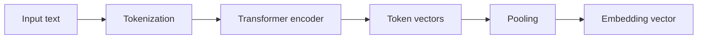
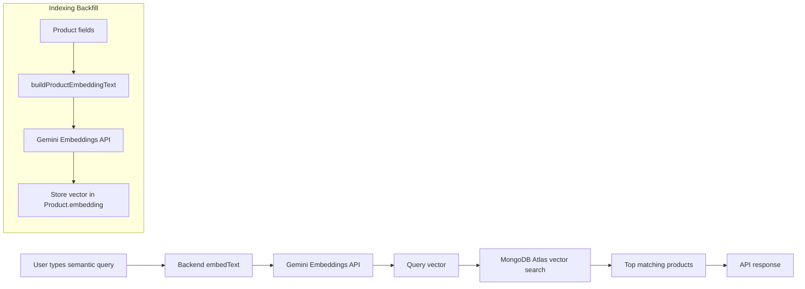

# Semantic Search (Product Search)

This document explains the semantic search feature added to the project and how it works end-to-end.

---

## 1) What is semantic search?

Semantic search finds items by meaning instead of exact keywords.

Example:
- Query: “books about clean code and maintainable backend”
- Keyword search may only match if those exact words appear.
- Semantic search can still match “Clean Architecture” or “Refactoring” because it compares meaning.

---

## 2) How it works in this project

We use two main parts:

1) **Gemini Embeddings** (Google AI)
- Convert text into a numeric vector (embedding) that represents meaning.
- The vector is a fixed-length list of numbers (dimensions) that captures semantic similarity.
- Similar meanings produce vectors that are close to each other in vector space.
- We use the model defined by `GEMINI_EMBED_MODEL` (default: `text-embedding-004`).
- The API call is server-side only so the API key is never exposed to the browser.
- If you change the embedding model later, you must re-embed products to keep results consistent.

**More detail (what the model does):**
- The model first tokenizes the input text (splits it into pieces the model understands).
- A transformer network processes these tokens through attention layers.
- Each token gets its own vector; the model then pools them into a single fixed-length vector.
- That final vector is the “embedding” used for similarity comparisons.

**Why this helps search:**
- Queries and products are embedded into the same vector space.
- MongoDB Atlas uses vector similarity (cosine) to find nearest neighbors.
- This is why “meaning-based” matches work even without exact keywords.

2) **MongoDB Atlas Vector Search**
- Stores vectors in `Product.embedding`.
- Finds the closest vectors to a query vector.

### Diagram: Gemini embeddings pipeline



---

## 3) Data flow (high level)

There are two phases:

### A) Indexing / Backfill
- Build a text summary from each product (title, author, category, EN/VI descriptions).
- Send that text to Gemini to get an embedding vector.
- Store the vector in `Product.embedding`.

### B) Query / Search
- User enters a semantic query in the sidebar.
- Backend converts the query to an embedding.
- MongoDB Atlas finds the nearest product vectors.
- API returns results + a similarity score.

---

## 4) Mermaid diagram (end-to-end)



---

## 5) Key backend pieces

- `Product.embedding` field (hidden from responses by default)
- `embedText()` and `buildProductEmbeddingText()` utility
- `GET /api/products/semantic-search?q=...` endpoint
- Backfill scripts:
  - `scripts/printEmbeddingDims.js`
  - `scripts/backfillProductEmbeddings.js`

---

## 6) Atlas Search index requirements

The vector index must include:
- `embedding` (vector)
- Filter fields used in the query

Recommended index JSON:

```json
{
  "mappings": {
    "dynamic": false,
    "fields": {
      "embedding": {
        "numDimensions": 768,
        "similarity": "cosine",
        "type": "vector"
      },
      "isActive": {
        "type": "boolean"
      },
      "category": {
        "type": "string",
        "analyzer": "lucene.keyword"
      }
    }
  }
}
```

---

## 7) Frontend behavior

- Sidebar search is **semantic-only** and runs on **button click**.
- The header search remains keyword-based.

---

## 8) Common issues

**Error:** `Path 'isActive' needs to be indexed as boolean`  
**Fix:** Add `isActive` to the Atlas search index.

**Error:** `references non-existent analyzers: keyword`  
**Fix:** Use `lucene.keyword` instead of `keyword`.

---

## 9) Quick checklist

- [ ] `GEMINI_API_KEY` set
- [ ] Vector index active in Atlas
- [ ] Embeddings backfilled
- [ ] `/api/products/semantic-search` returns results

---

If you want a hybrid search (keyword + semantic), add it as a separate endpoint or blend results in the backend.
